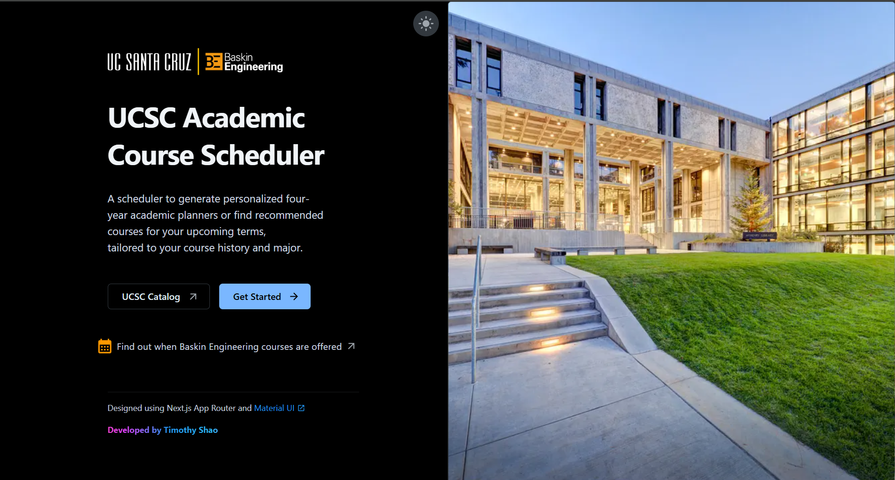
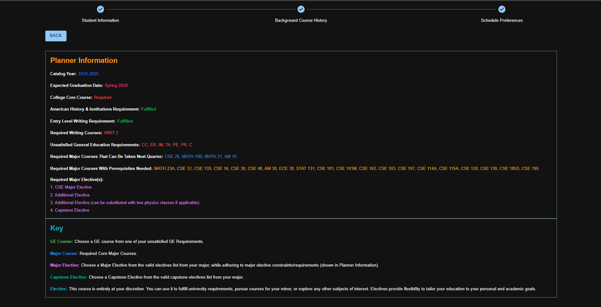
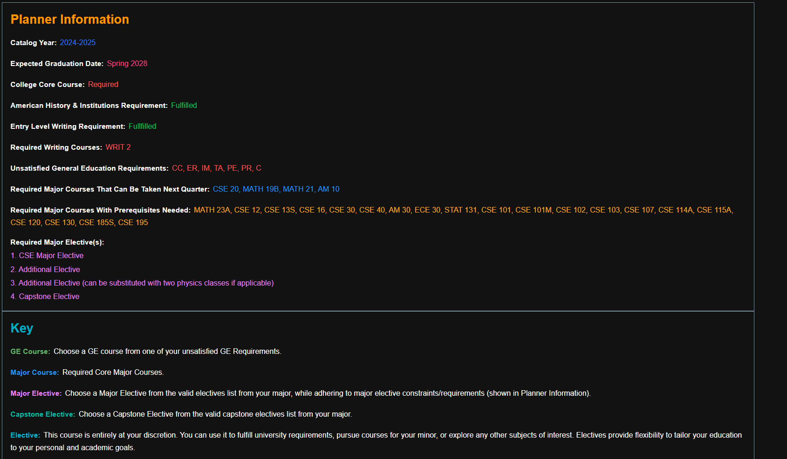
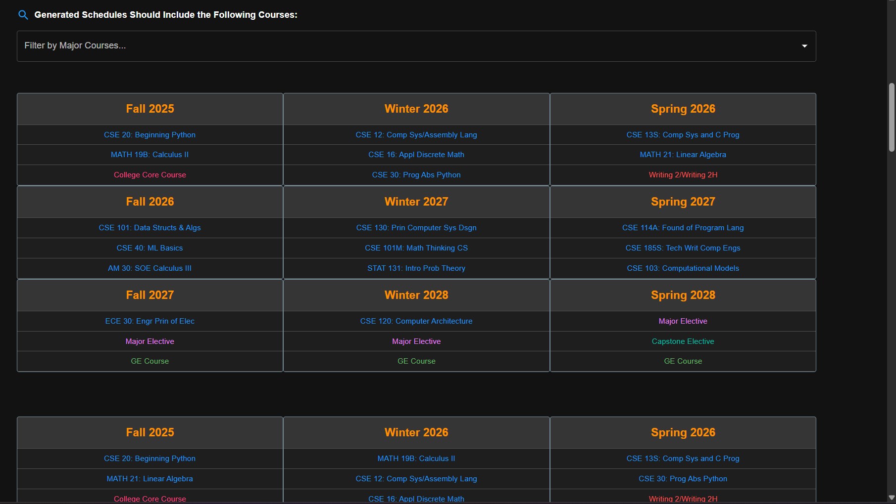

<!-- README.md -->

# 🎓 Baskin Engineering Course Scheduler

[](https://nextjs.org/)
[](https://www.typescriptlang.org/)
[](https://ucsc-course-scheduler-project.vercel.app)

> **Live Demo:** **[ucsc-course-scheduler-project.vercel.app](https://ucsc-course-scheduler-project.vercel.app)**  
> An intelligent academic planner for UCSC students — generate personalized four-year schedules or plan upcoming quarters based on your major, progress, and preferences.

---

## 📌 Overview

The **Baskin Engineering Course Scheduler** is a responsive web application that helps UCSC students **plan their entire academic journey**—from next quarter to graduation.  
Just fill out a quick three‑step form with your background, completed courses, and preferences, and the scheduler produces **conflict‑free, requirement‑aware plans** in ~2 seconds.

Key highlights:

- **Smart Planner** – Directed Acyclic Graph + enhanced Kahn’s algorithm to build valid course sequences.
- **Requirement Tracking** – Instantly see which GE, college, and major requirements are satisfied or outstanding.
- **What‑If Scenarios** – Generate 1‑, 3‑, or multi‑year plans and filter by preferred major courses.
- **Modern UX** – Built with **Next.js App Router**, **React Server Components**, and **Material UI**.

> Currently supports **B.S. Computer Science** in the **2025–2026 General Catalog**. More majors coming soon!

---

## 📸 Demo Snapshots

### Landing Page


---

### Completed Page


---

### Planner Information


---

### Generated Schedules


---

## ✨ Key Features

✅ **Smart Academic Planner**  
Generates schedules for the next quarter, next three quarters, or a full 4-year planner up to your graduation date.

✅ **Personalized Planning**  
Schedules are tailored to your completed coursework, placements, and graduation target.

✅ **Degree Requirement Tracking**  
Tracks completion of general education, college, and major requirements — highlights missing components and key prerequisites.

✅ **Interactive Course Preferences**  
Optional settings allow students to set their preferred number of classes per quarter or select desired major courses for short-term planning.

✅ **Fast Graph-Based Scheduling**  
Constructs a **Directed Acyclic Graph** of requirements and courses, with enhancements to **Kahn’s Algorithm**, generating accurate schedules in ~2 seconds.

✅ **Filter & Refine (Short‑Range)**  
For 1‑ to 3‑quarter plans, filter by specific major courses you’d like to take sooner.

✅ **Streamlined UI**  
Clean and modern interface built with **Material UI** and **React Server Components** for fast, responsive performance.

✅ **Responsive & Accessible**  
Mobile‑friendly UI with keyboard navigation and ARIA labels.

✅ **UCSC Resource Integration**  
Consolidates relevant UCSC resources like the General Catalog, GE Requirements, and Baskin course offerings.

---

## 🧠 How It Works (Usage)

The scheduling process is divided into three easy form sections:

1. **Student Info**  
   - Planning Horizon (1 quarter, 3 quarters, or full roadmap to graduation)
   - Catalog year  
   - Major (CS B.S.)  
   - College affiliation  
   - Expected graduation date  
   - Academic student status (continuing, freshman, transfer)

2. **Course History**  
   - Completed GE requirements  
   - AHR (American History & Institutions) fulfillment  
   - Writing/Math placement (if applicable)  
   - Completed CS major, elective, and capstone courses  

3. **Preferences (Optional)**  
   - Desired number of courses per quarter  

Once submitted, the backend runs a graph-based dependency analysis and returns optimized, valid course sequences that fulfill your selected constraints and requirements.

---

## 🛠 Tech Stack

| Layer | Tools |
|-------|-------|
| **Frontend** | Next.js (App Router) · React Server Components · TypeScript · Material UI |
| **Validation** | Zod |
| **Build / Deploy** | Vercel (Preview & Prod) |
| **Algorithm** | DAG construction · Kahn’s algorithm for topological sorting |

---

## 🚀 Getting Started

### Prerequisites

- **Node.js** ≥ 20  
- **npm** ≥ 10  

### Installation

```bash
# 1. Clone the repo
git clone https://github.com/thshao2/UCSC-Course-Scheduler-Project.git
cd UCSC-Course-Scheduler-Project

# 2. Install dependencies
npm install

```
### Running the Web Application
```
# Development (hot‑reload)
npm run dev

# Production build
npm run build
npm start

# Open http://localhost:3000 in your browser.
```
## 🤔  Why This Scheduler?
Too often, UCSC students find themselves overwhelmed by course planning, missing graduation requirements, or relying heavily on advisors. This tool automates that entire process — saving time and eliminating guesswork.

>💡 "Using this scheduler reduced my manual planning time by over 75%!" — UCSC B.S. CS Student

Whether you're a freshman starting from scratch or a junior catching up, this scheduler provides a reliable academic blueprint so you can focus on what really matters: learning.

## 🗺️ Roadmap
 - Support additional Baskin majors (Compter Engineering, CS Game Design, Electrical Engineering, etc.)

 - Import completed coursework directly from Cumulative Academic History in MyUCSC portal

 - PDF export of generated plans


## 🤝 Contributing
1. Fork the repo & create a branch (```git checkout -b feat/your-feature```).
2. Commit with Conventional Commits (```feat: add xyz```).
3. Push and open a Pull Request.

All contributions—bug fixes, docs, feature requests—are welcome!

## 👋 Contact

Built by [Timothy Shao](https://www.linkedin.com/in/timothy-shao)

Have suggestions or feedback? Feel free to reach out or submit an issue on GitHub!

*© 2025 Timothy Shao – Baskin Engineering Course Scheduler*
